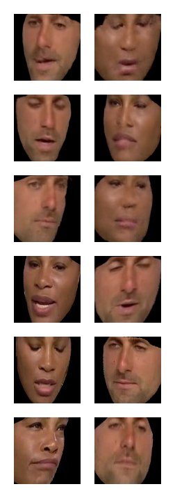

# Face swap with deep autoencoder

Simple face swapping using deep autoencoder. Mainly based on https://www.researchgate.net/publication/331427456_A_Light_Autoencoder_Networks_for_Face_Swapping . \
This repository contains code and dataset used for training. It also contains unit and e2e tests.
C# Project used for testing: https://github.com/pekalam/FaceSwapTest

## Usage

Training process can be run using following command (linux only)
```
python src/main.py --config-path=conf
```
Other entrypoints (docker images, notebooks) require github token for repo.

## Data

Training data was obtained from following website: https://www.kaggle.com/mikecp/faceswap . \
This project was created for research purposes only.

# Results



